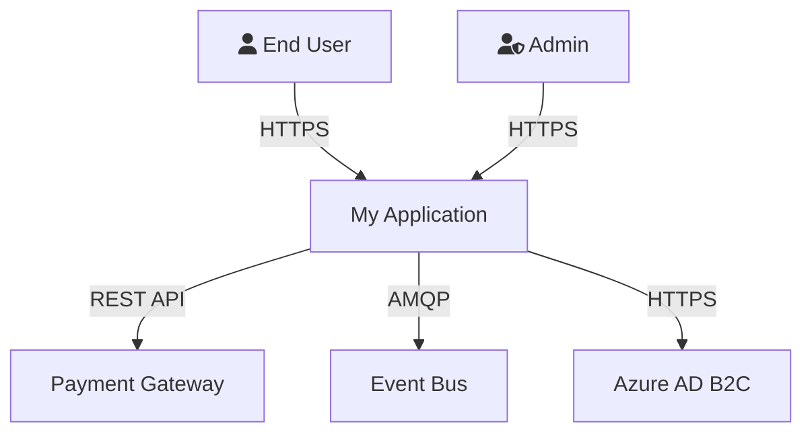
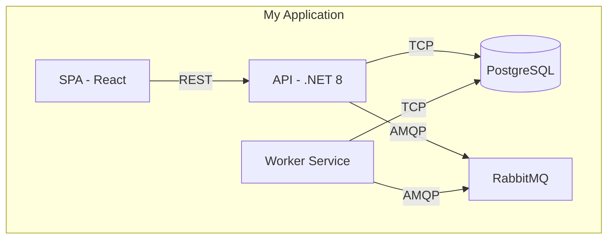
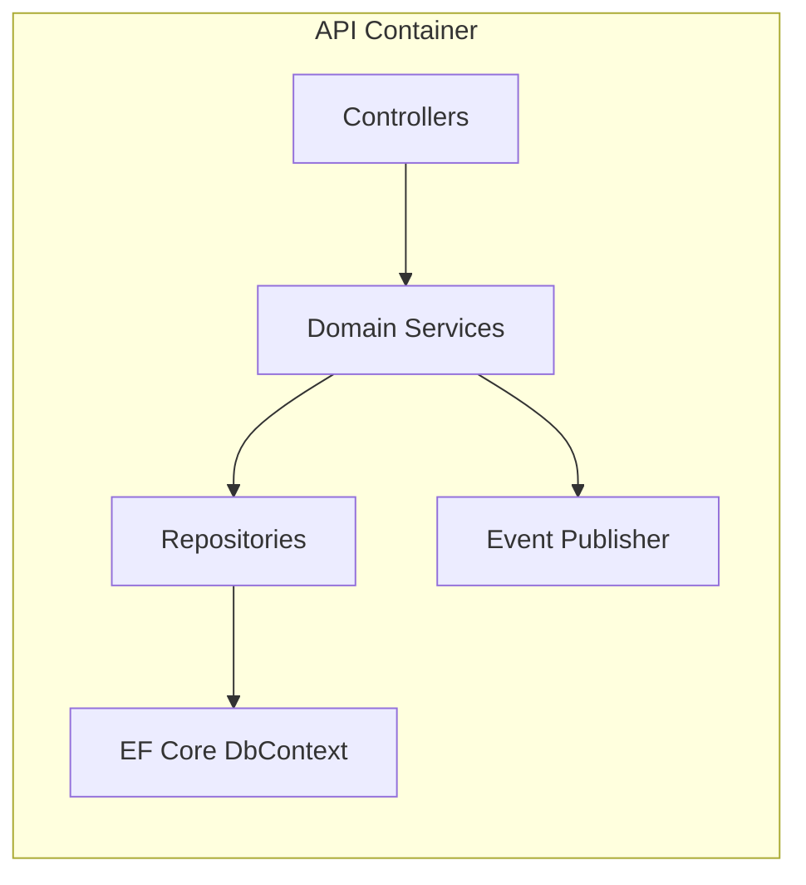
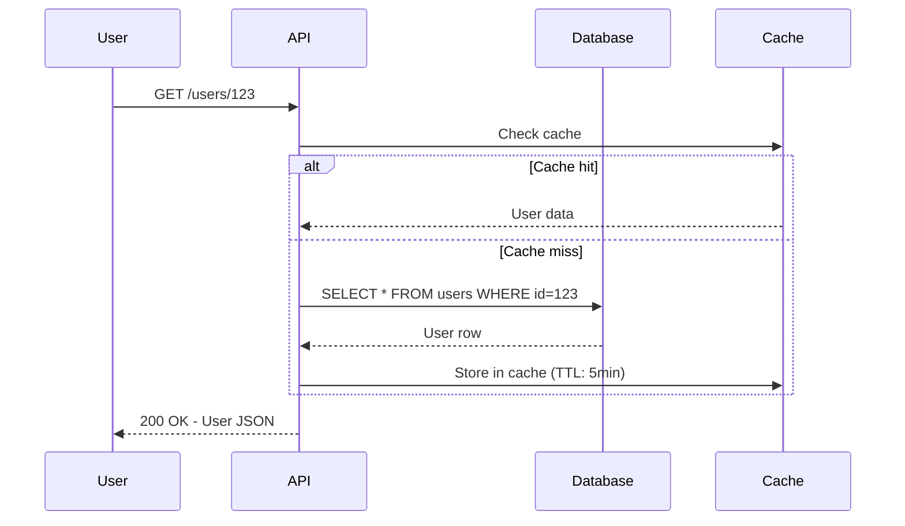
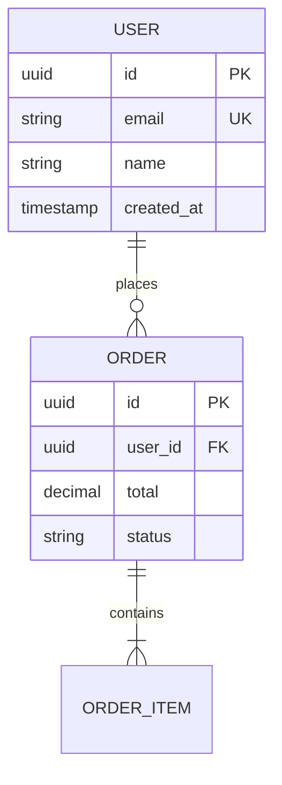

# Documentation Standards

## Core Philosophy

Documentation is a product, not a chore. If it's not written down, it doesn't exist. If it's outdated, it's worse than not existing — it's actively misleading. Every piece of documentation has an owner, a purpose, and a maintenance cadence.

**Principles:**
- **Write for the reader, not the writer.** The person reading your docs is probably stressed, in a hurry, and new to the codebase
- **Accuracy over completeness.** A short, accurate doc beats a comprehensive, outdated one
- **Docs live with code.** Documentation in the repo, versioned with the code, reviewed in PRs
- **Automate what you can.** API docs from OpenAPI specs, diagrams from code, changelogs from commits

## README Requirements

Every repository MUST have a README.md with these sections. A new team member should be able to set up and run the project from the README alone.

### Required Sections

```markdown
# Project Name

One-line description of what this project does and why it exists.

## Status

Build badge, deployment status, version badge.

## Prerequisites

- Exact versions of required tools (Node 20+, .NET 8 SDK, Docker)
- Required accounts/access (Azure subscription, API keys)
- Operating system requirements or notes

## Getting Started

Step-by-step instructions to go from zero to running locally:
1. Clone the repository
2. Install dependencies
3. Configure environment (copy .env.example to .env)
4. Run the application
5. Verify it works (expected output / URL to open)

## Architecture Overview

High-level architecture diagram (Mermaid) showing major components
and how they interact. Link to detailed architecture docs if they exist.

## Project Structure

Brief explanation of the directory structure — what goes where.

## Development

How to build, test, and lint locally.
How to run specific test suites.
Hot reload / watch mode instructions.

## Deployment

How the application is deployed (link to CI/CD pipeline).
Environment configuration.

## Contributing

Branch naming convention, PR process, review expectations.
Link to CONTRIBUTING.md for detailed guidelines.

## License

License type and link to LICENSE file.
```

### README Rules

- **No stale setup instructions.** If the setup process changes, the README is updated in the same PR
- **Commands must be copy-pasteable.** Use code blocks with the correct shell language tag
- **Don't assume context.** Spell out acronyms on first use. Link to external concepts
- **Keep it current.** Stale READMEs destroy trust. If something changes, update the README or link to a canonical doc

## API Documentation

### OpenAPI Specification (Mandatory for REST APIs)

- Every REST API must have an OpenAPI (Swagger) spec — generated from code annotations or maintained alongside code
- The spec is the contract. API implementation must match the spec exactly
- Include the spec in the repo: `docs/api/openapi.yaml`
- Generate human-readable docs from the spec (Swagger UI, Redocly, Stoplight)

### Documentation Requirements Per Endpoint

```markdown
### POST /api/v1/users

Create a new user account.

**Authentication:** Bearer token (admin role required)

**Request Body:**
| Field | Type | Required | Description |
|-------|------|----------|-------------|
| email | string | Yes | User's email address. Must be unique. |
| name | string | Yes | Display name, 2-100 characters. |
| role | string | No | One of: admin, member, viewer. Default: member. |

**Response: 201 Created**
```json
{
  "id": "usr_abc123",
  "email": "user@example.com",
  "name": "Jane Doe",
  "role": "member",
  "createdAt": "2024-01-15T10:30:00Z"
}
```

**Error Responses:**
| Status | Code | Description |
|--------|------|-------------|
| 400 | VALIDATION_ERROR | Invalid request body. See `errors` array for details. |
| 409 | DUPLICATE_EMAIL | A user with this email already exists. |
| 401 | UNAUTHORIZED | Missing or invalid bearer token. |
| 403 | FORBIDDEN | Caller does not have admin role. |
```

### API Documentation Rules

- **Every endpoint has an example** — request and response
- **Every error response is documented** — status code, error code, description, and when it occurs
- **Breaking changes are versioned** — new major version (v1 → v2), old version supported for deprecation period
- **Document rate limits, pagination, and filtering** — these are part of the API contract
- **Authentication is explicit** — which endpoints require auth, what type, what roles/scopes

## Architecture Diagrams

### Use Mermaid for All Diagrams

Mermaid diagrams are version-controlled, diff-friendly, and render natively in GitHub/Azure DevOps. No external tools needed, no binary files in the repo.

### C4 Model (Required for Architecture Documentation)

Use the C4 model levels to document architecture at appropriate detail levels:

#### Level 1: System Context — Who uses the system, what systems does it interact with?



#### Level 2: Container — What are the major deployable units?



#### Level 3: Component — What are the major components inside a container?



### Sequence Diagrams for Flows

Use sequence diagrams for any flow involving multiple components or services:



### Entity Relationship Diagrams for Data Models



### Diagram Standards

- **Every diagram has a title and brief description** explaining what it shows and when to reference it
- **Consistent styling:** Use the same colors and patterns across all diagrams in a project
- **Keep diagrams focused:** One concept per diagram. A diagram that shows everything shows nothing
- **Update diagrams when architecture changes** — stale diagrams are actively harmful
- **Store diagrams in `docs/architecture/`** with descriptive filenames

## Architecture Decision Records (ADRs)

### When to Write an ADR

Write an ADR for any decision that:
- Is hard to reverse (technology choice, data model design, API contract)
- Was debated by the team (capture the reasoning so future team members understand)
- Has significant consequences (cost, performance, security, maintainability)
- Goes against conventional wisdom (explain why the unconventional choice was right)

### ADR Template

```markdown
# ADR-{number}: {Title}

**Date:** YYYY-MM-DD
**Status:** Proposed | Accepted | Deprecated | Superseded by ADR-XXX
**Decision Makers:** Names of people involved

## Context

What is the problem or situation that requires a decision?
What are the forces at play (technical, business, team, timeline)?

## Decision

What is the decision that was made? State it clearly in one sentence,
then elaborate.

## Consequences

### Positive
- What gets better as a result of this decision?

### Negative
- What gets worse or becomes more complex?
- What trade-offs are we accepting?

### Neutral
- What changes that is neither better nor worse?

## Alternatives Considered

### Alternative 1: {Name}
- Description
- Pros
- Cons
- Why we didn't choose it

### Alternative 2: {Name}
- Description
- Pros
- Cons
- Why we didn't choose it
```

### ADR Rules

- **ADRs are immutable** — once accepted, don't modify. If a decision changes, write a new ADR that supersedes the old one
- **Number sequentially:** ADR-001, ADR-002, etc.
- **Store in the repo:** `docs/adr/` directory
- **Link from relevant code** — if a design pattern exists because of an ADR, reference it in comments

## Runbooks

### Every Production Service Needs a Runbook

Runbooks are the difference between a 5-minute resolution and a 2-hour escalation. Write them before you need them.

### Runbook Template

```markdown
# Runbook: {Service Name} - {Issue Type}

**Service:** {service name}
**Owner Team:** {team name}
**Last Updated:** YYYY-MM-DD
**Severity:** SEV1 | SEV2 | SEV3

## Symptom

What does the operator see? What alert fires?
Be specific: "Error rate on /api/orders exceeds 5% for 10 minutes"

## Diagnosis

Step-by-step investigation:
1. Check dashboard: {link to Grafana/App Insights dashboard}
2. Check logs: `kubectl logs -l app=my-service --tail=100`
3. Check dependencies: {list of dependent services and how to check them}
4. Check recent deployments: {link to deployment history}

## Resolution

### Quick Fix (Immediate Mitigation)
1. Restart pods: `kubectl rollout restart deployment/my-service`
2. Scale up: `kubectl scale deployment/my-service --replicas=5`
3. Rollback: `kubectl rollout undo deployment/my-service`

### Root Cause Fix
Steps to permanently resolve the underlying issue.

## Prevention

What should be done to prevent this from happening again?
- Configuration change
- Code fix
- Monitoring improvement
- Architecture change

## Escalation

If the above steps don't resolve the issue:
1. Contact: {on-call engineer} via {Teams/PagerDuty}
2. Escalate to: {team lead} after 30 minutes
3. Incident commander: {name} for SEV1
```

### Runbook Rules

- **Include actual commands** — not "restart the service" but `kubectl rollout restart deployment/my-service -n production`
- **Include links** to dashboards, logs, deployment history, and architecture docs
- **Test runbooks** during game days — an untested runbook is a wish, not a plan
- **Keep current** — update after every incident that revealed gaps
- **Store in repo** or team wiki, linked from the service's README

## Code Comments

### What to Comment

- **WHY, not WHAT:** The code shows what it does. Comments explain why it does it that way
- **Business rules:** "Discount applies only to orders > $100 because of marketing campaign XYZ"
- **Non-obvious complexity:** "Using binary search here because the list is pre-sorted and can exceed 1M items"
- **Workarounds:** "Azure SDK v5 has a bug where... This workaround can be removed when v5.1 ships (issue #123)"
- **External constraints:** "This timeout is set to 30s because the upstream payment API SLA guarantees response in 25s"

### What NOT to Comment

```csharp
// BAD: Restating the code
// Increment counter by 1
counter++;

// BAD: Commented-out code — delete it, Git remembers
// var oldImplementation = DoThingTheOldWay();

// BAD: TODO without issue reference
// TODO: Fix this later

// GOOD: TODO with tracking
// TODO(#1234): Replace with batch API when v3 ships in Q2 2025

// GOOD: Explaining WHY
// We use a semaphore here instead of a lock because this code path
// involves async I/O and lock doesn't support async/await.
```

### Comment Rules

- **No commented-out code.** Delete it. Git has full history. If you're scared, make a branch
- **TODOs must have issue references:** `// TODO(#1234): description`. Orphan TODOs are ignored forever
- **Update comments when code changes.** A wrong comment is worse than no comment
- **XML doc comments / JSDoc for public APIs** — every public method, class, and interface gets documentation

## Changelog

### CHANGELOG.md (Required for Libraries and Services)

Follow the [Keep a Changelog](https://keepachangelog.com/) format:

```markdown
# Changelog

All notable changes to this project will be documented in this file.

The format is based on [Keep a Changelog](https://keepachangelog.com/),
and this project adheres to [Semantic Versioning](https://semver.org/).

## [Unreleased]

### Added
- New user search API endpoint (#234)

### Changed
- Increased default pagination limit from 20 to 50 (#245)

### Fixed
- Fixed race condition in order processing (#251)

## [1.2.0] - 2024-01-15

### Added
- WebSocket support for real-time notifications (#200)

### Deprecated
- REST polling endpoint /api/notifications/poll — use WebSocket instead

### Security
- Updated lodash to 4.17.21 to address CVE-2021-23337
```

### Changelog Rules

- **Update changelog in the same PR** as the code change
- **Group by type:** Added, Changed, Deprecated, Removed, Fixed, Security
- **Reference issue/PR numbers** for traceability
- **Write for users:** Explain impact, not implementation details
- **Automate where possible:** Tools like conventional-changelog can generate from commit messages

## Onboarding Documentation

### Goal: Productive in 1 Day

A new team member should go from "first day" to "merged first PR" within their first day, given good onboarding docs.

### Required Onboarding Content

```markdown
# Onboarding Guide: {Team/Project Name}

## Day 1 Checklist
- [ ] Access: GitHub/Azure DevOps repo access
- [ ] Access: Azure subscription / cloud resources
- [ ] Access: Team communication channels (Teams, Slack)
- [ ] Access: Monitoring dashboards (Grafana, App Insights)
- [ ] Setup: Clone repo and run locally (follow README)
- [ ] Read: Architecture overview (docs/architecture/)
- [ ] Read: Team conventions (CONTRIBUTING.md)
- [ ] Meet: Schedule 1:1 with team lead and buddy

## Architecture Overview
Link to architecture docs with C4 diagrams.

## Key Decisions
Link to ADRs for major architectural decisions.

## Team Processes
- How we work (sprint cadence, ceremonies)
- How we deploy (pipeline overview)
- How we handle incidents (on-call rotation, escalation)
- How we review code (PR expectations, SLA for reviews)

## Common Tasks
Step-by-step guides for frequent tasks:
- Adding a new API endpoint
- Creating a database migration
- Adding a new background job
- Debugging a production issue

## Glossary
Domain-specific terms and acronyms the team uses.

## Who to Ask
Map of expertise: who knows what on the team.
```

## Documentation Anti-Patterns

| Anti-Pattern | Why It's Bad | Do This Instead |
|---|---|---|
| Docs in Confluence/wiki only | Gets stale, not versioned with code | Docs in repo, wiki for high-level |
| No README | New members can't get started | README is mandatory |
| Outdated diagrams | Misleading, creates wrong mental model | Update in same PR as code change |
| Commented-out code | Noise, confusing, never gets cleaned up | Delete it, Git remembers |
| TODO without issue | Never gets done, accumulates | TODO(#issue): description |
| Docs written once | Decay from day one | Assign owner, review quarterly |
| Only tribal knowledge | Bus factor of 1 | Write it down or it doesn't exist |
| Overly detailed READMEs | Nobody reads 50-page READMEs | Concise README, link to detailed docs |
| No API error documentation | Consumers guess at error handling | Document every error response |
| Screenshot-based diagrams | Can't version, can't search, can't update | Mermaid in markdown |
